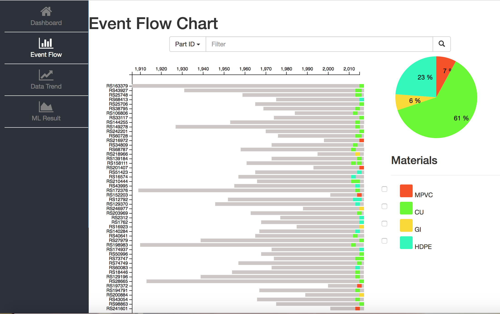
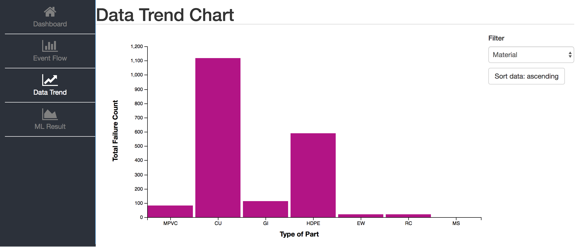

## Visual Analytics of Machine Learning Performance (CSIRO Project) ##

More Details from Original Repository in Bitbucket: https://bitbucket.org/will404/comp5615/wiki/Home

### Setup ###

The following instructions assume that the user 
has an environment that meets the following requirements

* Ubuntu 16.04
* Python 3.6
* Chrome Browser

1. First clone this repository into a local directory using git.

```
$ git clone https://github.com/Winton1992/Visual-Analytics-of-Machine-Learning-Performance.git
$ cd Visual-Analytics-of-Machine-Learning-Performance
```

2. Activate a python3.6 interpreter in the current terminal window.
To create a new virtual environment (optional). 
```
$ sudo apt-get install virtualenv
$ virtualenv -p python3 venv
$ . venv/bin/activate
```
Note: The following commands assume now that ```$ which python``` is
 pointing to a python3.X interpreter (otherwise use python3/pip3).
 
3. Install the project dependencies.

```
$ sudo pip install -r requirements.txt
```

### Run the application ###

```
$ python manage.py runserver
```
The application should now be running on the localhost.
Open a browser and enter http://127.0.0.1:8000.

### Testing the application ###

* UnitTests
```
$ python manage.py test
```
* UI tests
```
$ cd test/ui
$ ./test-ui
```

### Deployment ###

Deployment of the application to a webserver 
should require just a few adjustments to the settings.py 
file in the root directory.
Please refer to the documentation here:
https://docs.djangoproject.com/en/1.11/howto/deployment/




